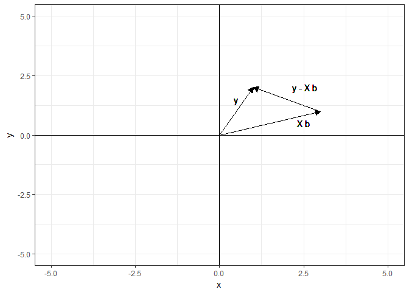
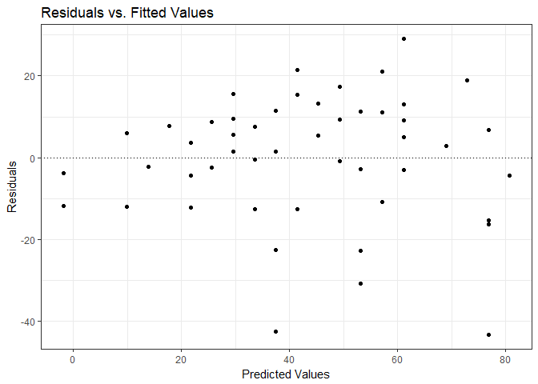

Understanding linear regression and its cousins
================
Pavan Gurazada
February 2018


``` r
library(AppliedPredictiveModeling)
library(caret)
library(tidyverse)

set.seed(20130810)
theme_set(theme_bw())
```

In this chapter we take a closer look at understanding the family of linear regression methods. The focus is on understanding how each method works, rather than the numerical plumbing associated with them. Hat-tip to [3Blue1Brown](https://www.youtube.com/channel/UCYO_jab_esuFRV4b17AJtAw) for kindling the geometric intuition. Most of the geometric ideas in the introduction are a direct summary of the information presented in these videos. This is more of a 'teach-myself-how-things-work' while speaking in code. Hence, the idea is to describe the geometry of several linear modeling algorithms. The emphasis is on undertsanding why things are the way there are and not how.

To reiterate, there is a strong case for numerical linear algebra. However, it is a lot more fun to think in terms of the geometry of linear models rather than sequences of floating pointoperations.

Introduction
------------

*Idea 1*. Any point in space can be represented by a vector, i.e., an arrow drawn from a fixed origin to the point. The origin never moves and the tail of every vector lies on the origin. The coordinates of a vector encode the instructions of how to reach the point it represents starting from the origin and moving parallel to the axes, in order, i.e., *x*, *y*, *z*, ….

``` r
ggplot(data.frame(x = -5:5, y = -5:5), aes(x, y)) +
  geom_segment(aes(x = 0, y = 0, xend = 1, yend = 2), 
               arrow = arrow(ends = "last", type = "closed", length = unit(0.1, "inches"))) + 
  geom_segment(aes(x = 0, y = 0, xend = 3, yend = 1), 
               arrow = arrow(ends = "last", type = "closed", length = unit(0.1, "inches"))) +
  geom_segment(aes(x = 3, y = 1, xend = 1, yend = 2), 
               arrow = arrow(ends = "last", type = "closed", length = unit(0.1, "inches"))) +
  scale_x_continuous(limits = c(-5, 5)) + 
  scale_y_continuous(limits = c(-5, 5)) +
  geom_vline(aes(xintercept = 0)) + 
  geom_hline(aes(yintercept = 0)) +
  geom_text(aes(x = 0.5, y = 0.5, label = "y"), nudge_y = 1) + 
  geom_text(aes(x = 1.5, y = 0.5, label = "X b"), nudge_x = 1) +
  geom_text(aes(x = 1.5, y = 2, label = " y - X b"), nudge_x = 1) 
```



*Idea 2*. Vector addition is an extension of the geometry of addition of two real numbers represented on the number line. For e.g., 2 + 5 represents a movement of 2 steps to begin with and 5 steps in the same direction ending up 7 steps away from a fixed origin. Similarly, **v** + **u** represents a movement along **v** starting from the origin and moving parallel to **u** from the tip of **v**. In this way, vector addition captures the notion that vectors have a size and direction.

*Idea 3*. Multiplication of a vector by real numbers is equivalent to squishing or enlarging the vectors in the same direction (for positive reals) or in the opposite direction (for negative reals). This is the reason why real numbers are called scalars.

*Idea 4*. Each coordinate of a vector squishes or enlarges unit vectors (**i**, **j**, …) along the axes. Adding these scaled unit vectors gives us the original vector. The unit vectors are called the basis vectors of a coordinate system. By altering the choices of the scalars we can reach every point in the space mapped by the basis vectors.

The choice of basis vectors is not unique. This implies that we could have chosen a non-standard arbitrary set of vectors and through a judicious choice of scalars reached every point in the space mapped by the unit vectors. The space remains the same but the method we use to reach that point, i.e., the choice of the axes differs. The origin is always fixed.

*Idea 5*. The process of scaling and adding a set of vectors is called a linear combination. So, a linear combination of the set **v**<sub>**1**</sub>, **v**<sub>**2**</sub>, … is *b*<sub>1</sub>**v**<sub>**1**</sub> + *b*<sub>2</sub>**v**<sub>**2**</sub> + …. By varying the choice of *b*'s we can reach the space covered by the set of vectors. The set of all possible vectors one can reach using a linear combination of a set of vectors is called the span of the vectors.

*Idea 6*. In the situation where a subset of vectors point in the same direction or when a vector is in the span of others in the set, the reach of the linear combination is limited, i.e., there is redundant information. The linear combination of these vectors hence does not cover the entire space. In this case, the basis vectors are linearly dependent.

This illustrates why having a nice set of basis vectors is important if we wish to explore in the entire parameter space.

*Idea 7*. Matrices encode the idea of linear transformations numerically. In these transformations, the origin remains fixed and the axes and the grid lines remain parallel and evenly spaced (i.e., the scale of the axes cannot be manipulated independent of each other). Linear transformation in essense produce a new space centered at the same origin where the vectors from the original space now lie in a different position. To track where a vector **v** lands after a linear transformation, we only need to track where the basis vectors of the original transformation **i**, **j**, … land up.

In other words the transformative effect of the linear transformation can be recorded through the transformation in the basis vectors and every other vector can be derived from these. So, a general vector **v** = *v*<sub>1</sub>**i** + *v*<sub>2</sub>**j** + … is mapped to a new vector **v**<sup>′</sup> = *v*<sub>1</sub>**i**<sup>′</sup> + *v*<sub>2</sub>**j**<sup>′</sup> + …. Since we need to only keep a track of where the basis vectors go, this transformation is encoded as a square matrix where each column of the matrix represents the position of the new basis vectors **i**<sup>′</sup>, **j**<sup>′</sup>, … after the transformation.

If the new basis vectors are linearly dependent, all of space is squished into a space of lesser dimension.

Every matrix is a linear transformation of space. Multiplying a vector with the matrix on the left provides the new position of the vector in the transformed space.

A chain of linear transformations, for e.g., rotation (say **A**) followed by shear (say **B**), the final position of a vector **v** is then **B**(**A****v**). This brings forth the notion of a product of two matrices as a composition of two linear transformations.

Overall view of linear models
-----------------------------

With this initial intuition, we can explore the geometry of linear models. In linear modeling, we predict an outcome vector *y* using a set of feature vectors, usually collected into a model matrix *X*. Since the features are a choice of the analyst, the model matrix is the feature space as defined by the analyst. As discussed earlier, multiplying this matrix with a vector translates the vector from the standard basis to the feature space. Since the outcome is also measured in the feature space, linear models seek to minimize the difference between the outcome and the transformed vector. Hence, we seek a solution to the ideal vector (*b*) that when transformed to the parameter space is closest to the outcome vector *y*. For a new model matrix *X*<sub>*t*</sub> in the feature space, this same transformation *X*<sub>*t*</sub>*b* maps these points (hopefully) close to the actual outcome.

Different flavors of linear models
----------------------------------

1.  *OLS* models seek to find the *b* that minimizes the squared error, i.e., (*y* − ​*X*​*b*)<sup>2</sup>. This problem admits a well-known closed form solution and hence can be used to compute *b* without iteration. We can [re-create the wheel](https://www.r-bloggers.com/create-your-machine-learning-library-from-scratch-with-r-1-3/), by creating a OLS linear regression object, defining the predict and plot methods for it. This is a nice example where the mathematics is simple so the R mechanics of creating model objects can be understood clearly:

``` r
fitLM <- function(X, y, intercept = TRUE, lambda = 0) {
  if (!is.matrix(X)) {
    X <- as.matrix(X)
  } 
  
  if (!is.matrix(y)) {
    y <- as.matrix(y)
  }
  
  if (intercept) {
    X <- cbind(1, X)
  }
  
  output <- list(intercept = intercept)
  
  output$coefs <- solve(t(X) %*% X) %*% t(X) %*% y
  output$preds <- X  %*% output$coefs
  output$residuals <- output$preds - y
  output$MSE <- mean(output$residuals^2)
  
  attr(output, "class") <- "naiveLM"
  return (output)
}

predict.naiveLM <- function(naiveLMObject, X, ...) {
  if (!is.matrix(X)) {
    X <- as.matrix(X)
  }
  
  if (naiveLMObject$intercept) {
    X <- cbind(1, X)
  }
  
  return (X %*% naiveLMObject$coefs)
}

plot.naiveLM <- function(naiveLMObject, bins = 30, ...) {
  qplot(naiveLMObject$preds,
        naiveLMObject$residuals, 
        geom = "point") +
    xlab("Predicted Values") + 
    ylab("Residuals") + 
    geom_hline(aes(yintercept = 0), linetype = "dotted") + 
    ggtitle("Residuals vs. Fitted Values")
}

myLM <- fitLM(cars[, 1], cars[, 2])
glimpse(myLM)
```

    ## List of 5
    ##  $ intercept: logi TRUE
    ##  $ coefs    : num [1:2, 1] -17.58 3.93
    ##  $ preds    : num [1:50, 1] -1.85 -1.85 9.95 9.95 13.88 ...
    ##  $ residuals: num [1:50, 1] -3.85 -11.85 5.95 -12.05 -2.12 ...
    ##  $ MSE      : num 227
    ##  - attr(*, "class")= chr "naiveLM"

``` r
print(myLM$coefs)
```

    ##            [,1]
    ## [1,] -17.579095
    ## [2,]   3.932409

``` r
plot(myLM)
```



Another way to derive the regression coefficients is to use the Maximum Likelihood Estimation (MLE) technique. Here, we assume that the residuals are i.i.d. standard normal and derive how likely is it to observe the data.

Again, [reinventing the wheel](https://www.r-bloggers.com/fitting-a-model-by-maximum-likelihood/). In my opinion, there is something mathematically comforting about this approach. We build up the probability distribution of the residuals and then hand it over to an optimization routine to minimize this. There is a clean separation between the logic of the estimation routine and the assumptions are clear from the outset.

Start with some fake data

``` r
N <- 1e4

x <- runif(N)
y <- 3 + 5 * x + rnorm(N)
```

The residuals likelihood is calculated by drawing from a normal distribution

``` r
logLikelihood <- function(beta0, beta1, mu, sigma) {
  resids <- y - (beta0 + x * beta1) 
  
  resids <- suppressWarnings(dnorm(resids, mu, sigma))
  return(-sum(log(resids)))
}
```

The initial guess in the MLE is very important

``` r
# fit <- stats4::mle(logLikelihood, 
#                    start = list(beta0 = 3, beta1 = 1, mu = 0, sigma = 1))

fit <- stats4::mle(logLikelihood,
                   start = list(beta0 = 2, beta1 = 1.5, sigma = 1),
                   fixed = list(mu = 0),
                   nobs = length(y))

print(fit)
```

    ## 
    ## Call:
    ## stats4::mle(minuslogl = logLikelihood, start = list(beta0 = 2, 
    ##     beta1 = 1.5, sigma = 1), fixed = list(mu = 0), nobs = length(y))
    ## 
    ## Coefficients:
    ##    beta0    beta1       mu    sigma 
    ## 2.997893 5.018504 0.000000 1.002325

Fitting a different distribution of residuals is a simple matter of changing the `dnorm()` in the log likelihood function to a different distribution. Choosing assumptions and starting points for MLE, though, is not for the faint heart.

1.  *PLS* models seek to find the *b* that maximizes the correlation between *X**b* and *y*. Hence, PLS build up linear combinations of the features as an intermediate step, building up an alternate basis as a result. It then iteratively solves for the optimal solution that maximizes the correlation with *y*, i.e., *a**r**g**m**a**x*(*c**o**r*(*X**b*, *y*)) while at the same time minimizing the least squared error as in the case of a simpel linear model. This is particularly helpful when we have more features than the data.

2.  *Penalized least squares* models are an extension of the OLS models discussed earlier. In these models, a penalty is added to the SSE ($ = (y - Xb)^2$) to reduce the variance of the model estimates while increasing the bias. For *ridge regression*,
    $$SSE = (y - X\\!b)^2 + \\lambda \\sum\_{j = 1}^{P} \\! b\_j^2$$
     We can infer from this equation that the only way SSE can reduce if we penalize high values of *b*. Thus the ridge regression shrinks the coefficients towards 0. For *lasso* (least absolute shrinkage and selection operator),
    *S**S**E* = (*y* − ​*X**b*)<sup>2</sup> + *λ**Σ*<sub>*j* = 1</sub><sup>*P*</sup>​|*b*<sub>*j*</sub>|
